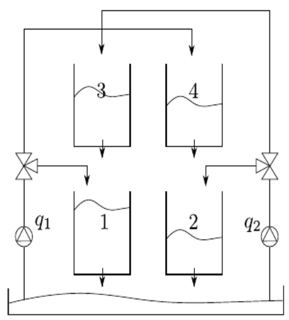

# QTank Gym

The Quadruple-Tank Process is a very simple interconected dynamic system, commonly used to benchmark control strategies. It involves an interconnection of four tanks fed by two hydraulic pumps whose flow is distributed by a three-way valve each. Each of these tanks has an orifice located in the bottom so that fluid may drain by way of gravity.

A schematic diagram of the process is shown in the figure below. The process is described in [Johansson, 2000](https://www.researchgate.net/publication/260586337_The_Quadruple-Tank_Process_A_Multivariable_Laboratory_Process_with_an_Adjustable_Zero).

Besides the non-linearities, the three-way valves define if the linearized Quadruple-Tank Process has minimum-phase or nonminimum-phase characteristics. 

Here, the process was adjusted to a minimum-phase behavior.

## Reference

Johansson, K. H. (2000). The quadruple-tank process: A multivariable laboratory process with an adjustable zero, IEEE Transactions on Control Systems Technology 8: 456–465.